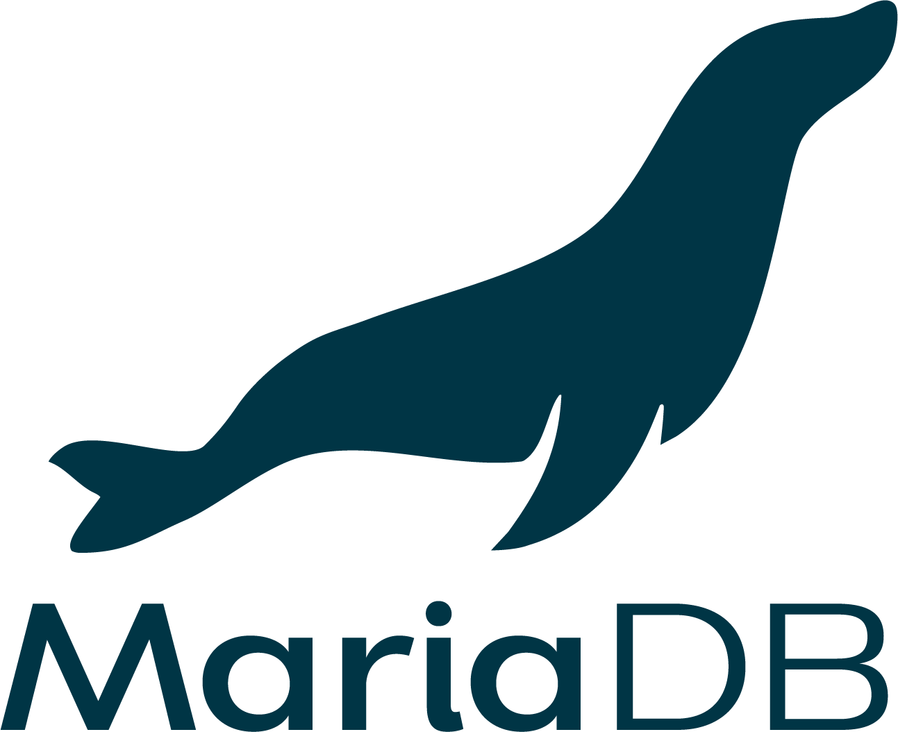
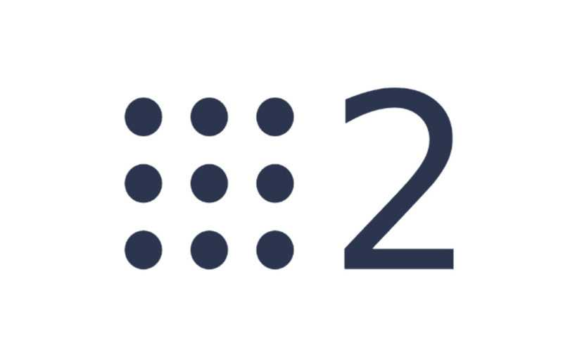

# Hi 👋 I'm Unai Bermúdez

### Full Stack Developer @ LKS Next · Bilbao, Basque Country
### Computer Science Graduate · University of the Basque Country (UPV/EHU)

I build enterprise web applications with React, TypeScript, Java and Spring Boot. Currently working on B2B solutions and exploring AI engineering on the side.

Check out my projects and blog at **[unaibermudez.github.io](https://unaibermudez.github.io)**

## Experience

**Junior Full Stack Developer, LKS Next** (2024 – Present)
Working on B2B enterprise projects. Frontend in React, backend integration, code quality (SonarQube), deployment.

**Formula Student Bizkaia**
Path planning for autonomous driving with ROS2 and Python. Competed at FSUK Silverstone 2024.

## Currently learning

AWS · Testing (JUnit, Mockito, Vitest) · AI Engineering fundamentals

## Socials

 <a href="https://www.github.com/unaibermudez" target="_blank" rel="noreferrer"> <picture> <source media="(prefers-color-scheme: dark)" srcset="https://raw.githubusercontent.com/danielcranney/readme-generator/main/public/icons/socials/github-dark.svg" /> <source media="(prefers-color-scheme: light)" srcset="https://raw.githubusercontent.com/danielcranney/readme-generator/main/public/icons/socials/github.svg" />  </picture> </a>  <a href="https://www.linkedin.com/in/unai-bermudez-osaba-708695269/" target="_blank" rel="noreferrer"> <picture> <source media="(prefers-color-scheme: dark)" srcset="https://raw.githubusercontent.com/danielcranney/readme-generator/main/public/icons/socials/linkedin-dark.svg" /> <source media="(prefers-color-scheme: light)" srcset="https://raw.githubusercontent.com/danielcranney/readme-generator/main/public/icons/socials/linkedin.svg" />  </picture> </a>

## Tech Stack

### Frontend

### Backend

### Databases

### DevOps & Tools

# 📊 GitHub Stats:
  
