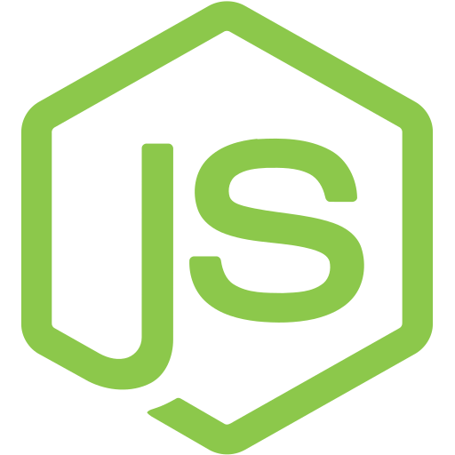
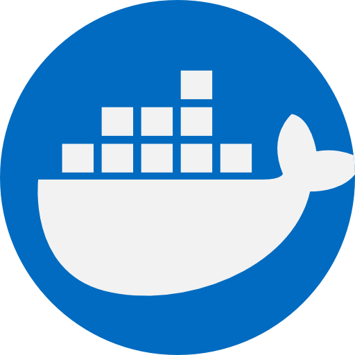
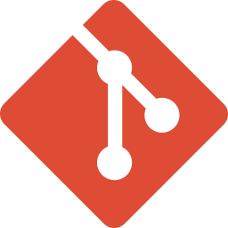

# Hi 👋 I'm Unai Bermúdez

**Full Stack Developer @ LKS Next · Bilbao, Basque Country**
Computer Science Graduate · University of the Basque Country (UPV/EHU)

I build enterprise web applications end to end: data model and REST APIs with Java and Spring Boot, PostgreSQL, authentication with OAuth2 and JWT, and the React front end on top.

🌐 **[unaibermudez.github.io](https://unaibermudez.github.io)** · 💼 **[LinkedIn](https://www.linkedin.com/in/unai-bermudez-osaba-708695269/)**

## Experience

**Junior Full Stack Developer, LKS Next** (2024 – Present)
Full-stack work on B2B enterprise projects: Spring Boot services and REST APIs, PostgreSQL with Liquibase migrations, integration with an external electronic signature system, React front ends, code quality with SonarQube and deployment.

**Formula Student Bizkaia**
Path planning for autonomous driving with ROS2 and Python. Competed at FSUK Silverstone 2024.

## Projects

**[TripMap](https://github.com/unaibermudez/TripMap)** · [live demo](https://unaibermudez.github.io/TripMap/)
Interactive map and timeline to tell the story of a trip. Astro, React, MapLibre and Zustand, with a Zod-validated data model, 155 unit tests and visual regression tests with Playwright.

**[Stockle](https://github.com/unaibermudez/stockle)**
Daily Wordle-style game for guessing stocks. Vanilla JavaScript, no build step and no dependencies. Prices are refreshed by a scheduled GitHub Action.

**[Commit Drawings](https://github.com/unaibermudez/github-commit-drawingsV2)**
Draw a pattern on the GitHub contribution grid and export a Bash or PowerShell script that recreates it using `git fast-import`. React, TypeScript, Vite and Tailwind.

**[Portfolio & blog](https://github.com/unaibermudez/unaibermudez.github.io)**
Bilingual personal site built with Astro. One URL serves both Spanish and English, with generated OG images and full-text search.

## Stack

### Backend

### Databases

### Infrastructure

### Frontend

### Everyday tools

### Robotics

Path planning for autonomous driving at Formula Student Bizkaia.

### Ways of working

## Currently learning

Integration testing with Testcontainers · Transactions and isolation levels in Spring · Multi-tenant data isolation with PostgreSQL RLS

## Socials

 <a href="https://www.github.com/unaibermudez" target="_blank" rel="noreferrer"> <picture> <source media="(prefers-color-scheme: dark)" srcset="https://raw.githubusercontent.com/danielcranney/readme-generator/main/public/icons/socials/github-dark.svg" /> <source media="(prefers-color-scheme: light)" srcset="https://raw.githubusercontent.com/danielcranney/readme-generator/main/public/icons/socials/github.svg" />  </picture> </a>  <a href="https://www.linkedin.com/in/unai-bermudez-osaba-708695269/" target="_blank" rel="noreferrer"> <picture> <source media="(prefers-color-scheme: dark)" srcset="https://raw.githubusercontent.com/danielcranney/readme-generator/main/public/icons/socials/linkedin-dark.svg" /> <source media="(prefers-color-scheme: light)" srcset="https://raw.githubusercontent.com/danielcranney/readme-generator/main/public/icons/socials/linkedin.svg" />  </picture> </a>

## GitHub Stats

